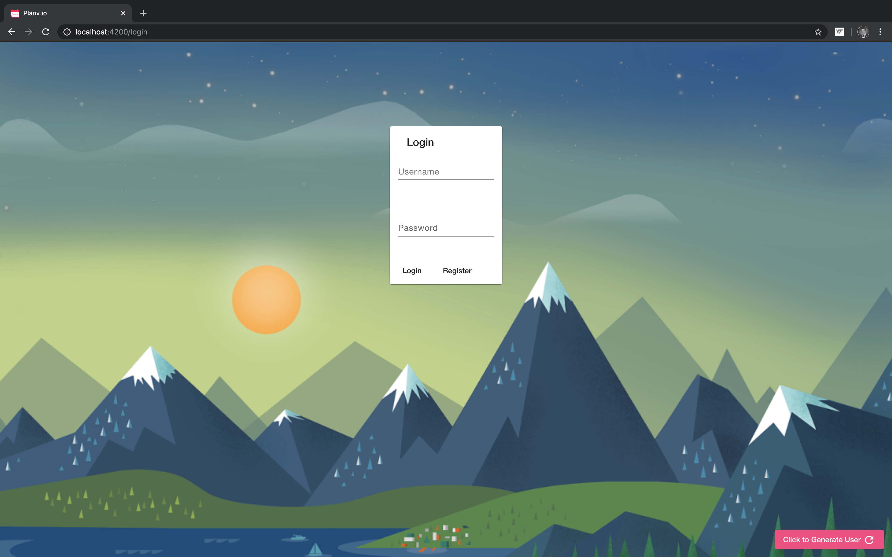
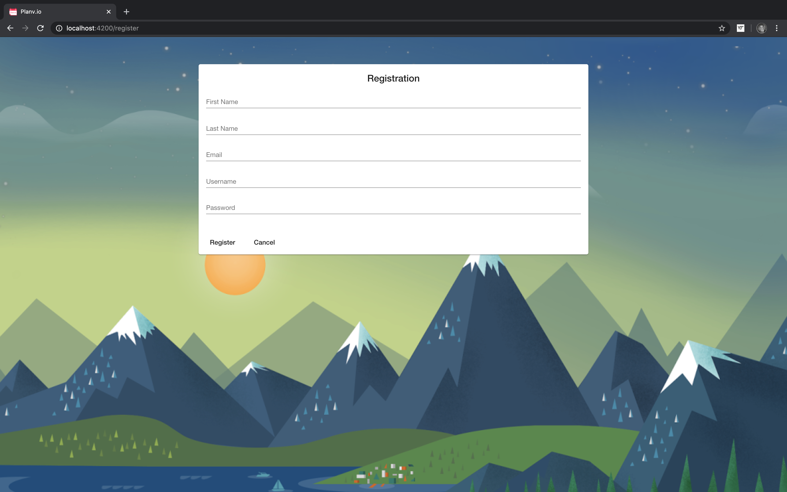

# Planv.io
Planv.io is a web application for students to track their personal and friends' assignments, schedule, and workload.

## Description
During CS 3754 (Full Stack Web Development), we were tasked with coming up with an open-ended final project to show off our skills that we learned for the semester. Our group needed to meet outside of class, but figuring out when everyone was 'free' was long and tedious. That's how Planv.io came about.

## Images
### Login

### Register

## Members
* Danny Torney
* Drew Perry
* Ryan Marcus

## Score
* 400/400

## Technology
### Front End
* Angular  
  * HTML/CSS/TS
  * Google Material Theme
### Back End
* Server-side 
   * Node
* Middleware
   * Express
* Database
   * Mongo

 

