# Planv.io
Planv.io is a web application for students to track their personal and friends' assignments, schedule, and workload.

## Description
During CS 3754 (Full Stack Web Development), we were tasked with coming up with an open-ended final project to show off our skills learned from the course. Our group needed to meet outside of class, but figuring out when everyone was available was difficult and aggravating. We decided to build Planv.io to make tracking schoolwork and keeping an eye out on your friends a lot easier.

## Notes
The "Generate User/Data" buttons below are for demo purposes only.

## Images
### Home
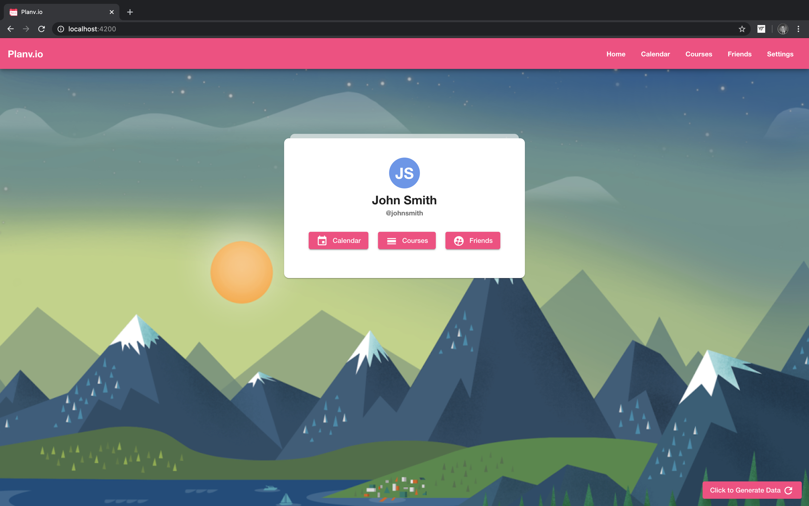
### Login

### Register

### Calendar
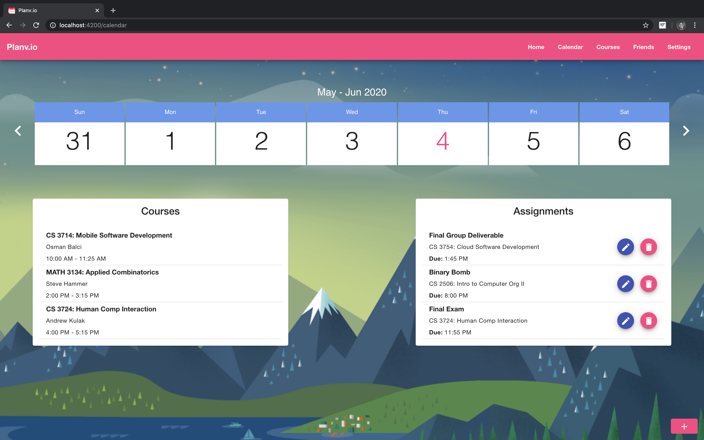
### Add Assigment
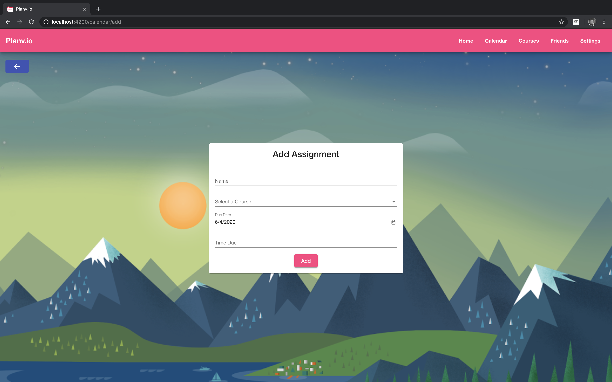
### Edit Assignment
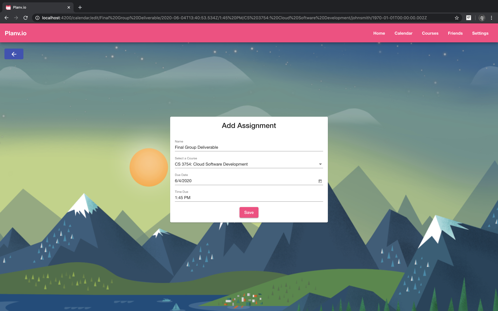
### Courses
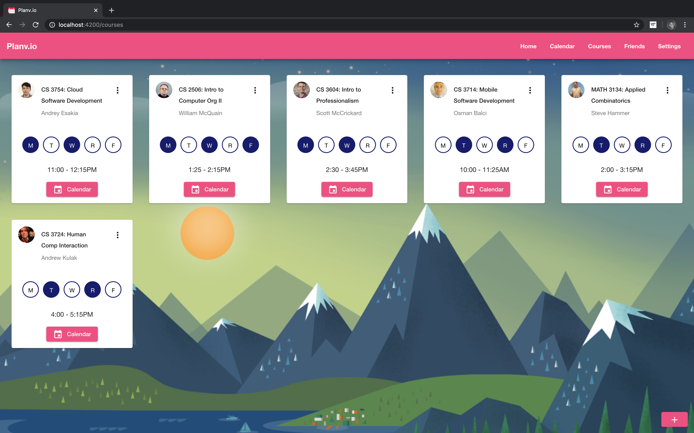
### Add Course
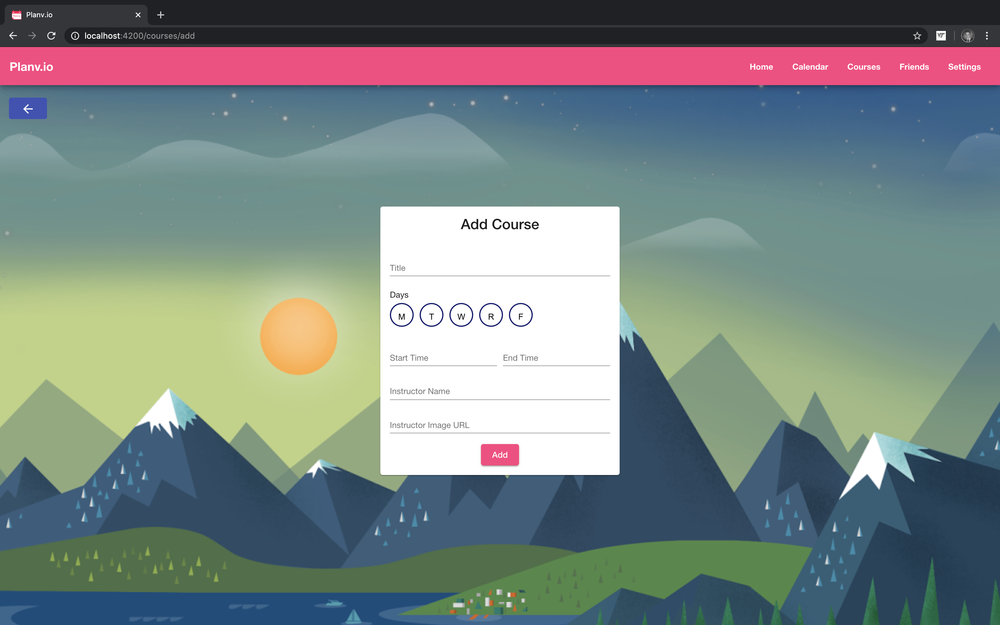
### Edit Course

### Friends
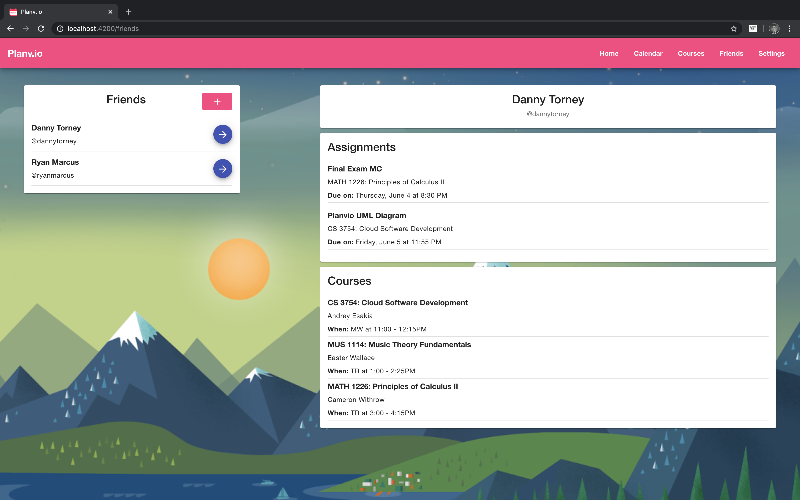
### Add Friend
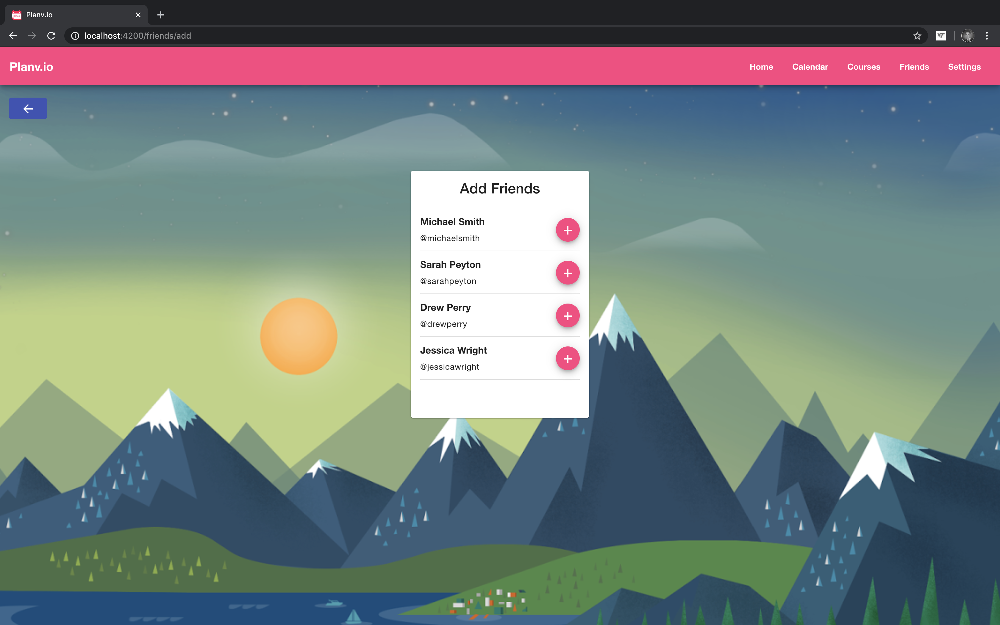
### Friend Added
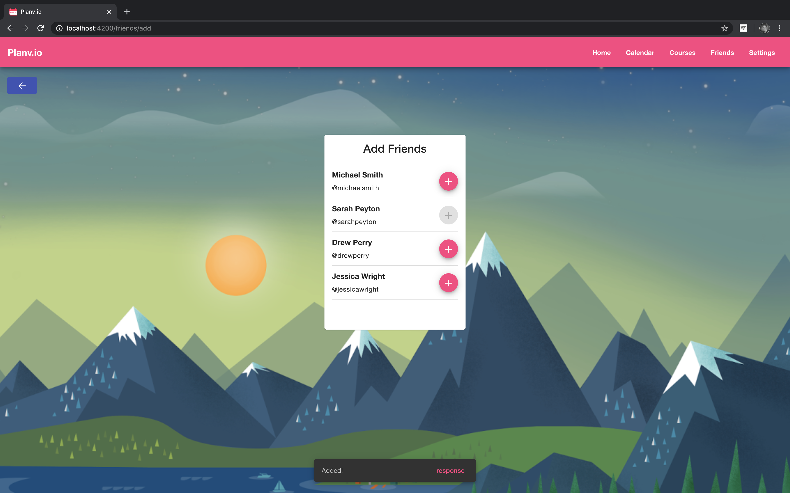
### New Friend
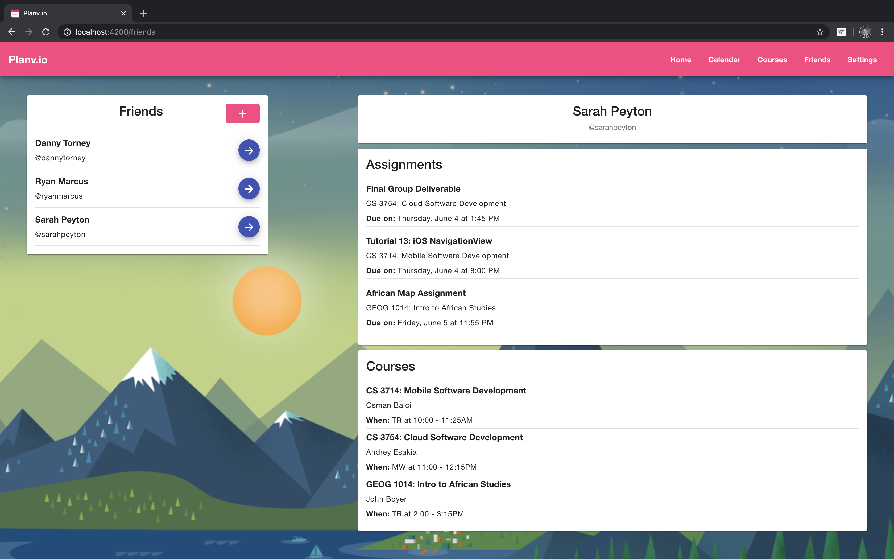
### Settings
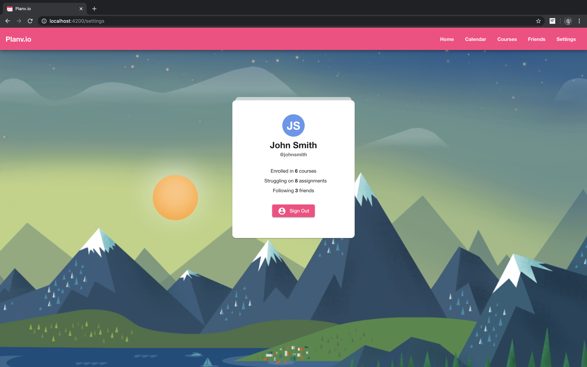

## Members
* Danny Torney
* Drew Perry
* Ryan Marcus

## Score
* 400/400

## Technology
### Front End
* Angular  
  * HTML/CSS/TS
  * Google Material Theme
### Back End
* Server-side 
   * Node
* Middleware
   * Express
* Database
   * Mongo
   
## How to Run
* Mongo
  * Command: 'Mongod'
* Node
  * Navigate inside Node folder
  * Command: 'node app.js'
* Angular
  * Navigate inside Angular folder
  * Command: 'ng serve'

 

